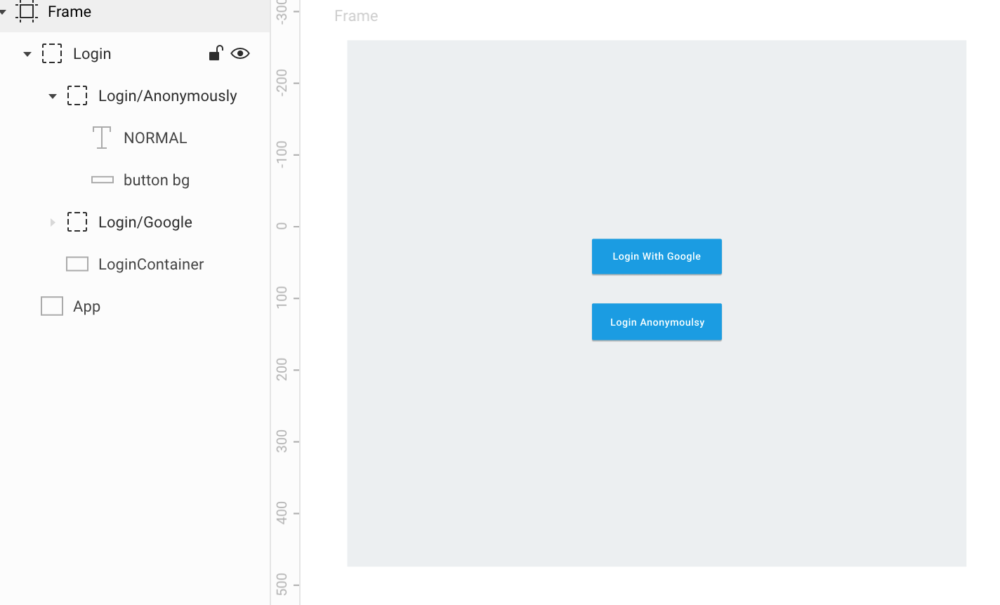

# Build a React App with Firebase Auth and Realtime Database

### Overview

We want to build a bookmarking app that allows a user to add links and metadata and then be able to search through them.

### App description

* If a user is not authenticated, they should see a Login/Register screen
* A user can choose to login/register with Google or Anonymously.
* Once a user is authenticated the login/register buttons should disappear.
* If a user is authenticated, they should see a : 
  * A big text input with auto-complete.
  * A small button to logout.
  * A list of all their bookmarks sorted by last used.
* Once the user starts typing, the autocomplete field should suggest clickable links that will open the link in a new tab.

Looking at the app description we will need to use `firebase/auth` and `firebase/database` or `firebase/firestore`

### App wireframe

#### Now that we have the requirements we can get started !

You can read the whole code [here](https://github.com/rakannimer/react-firebase/tree/master/modules/tutorial-bookmarking-app) if you want to go straight to the code. 

Every step below will have a matching git commit that you can browse.

