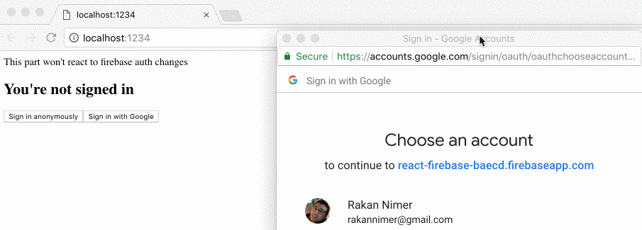
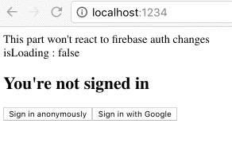
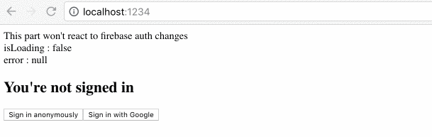

# Adding Google and Anonymous Auth

### Before you begin : 

1. Make sure to enable Google SignIn. [How](https://firebase.google.com/docs/auth/web/google-signin#before_you_begin) 
2. Make sure to enable Anonymous SignIn: [How](https://firebase.google.com/docs/auth/web/anonymous-auth) 

That's it. Now we can add the buttons to perform the sign in action.

### Adding Anonymous Auth



```jsx
import * as React from "react";
import { render } from "react-dom";
import {
  FirebaseAuthProvider,
  FirebaseAuthConsumer
} from "@react-firebase/auth";
import firebase from "firebase/app";
import { config } from "./test-credentials";

const IDontCareAboutFirebaseAuth = () => {
  return <div>This part won't react to firebase auth changes</div>;
};

const App = () => {
  return (
    <div>
      <IDontCareAboutFirebaseAuth />
      <FirebaseAuthProvider {...config} firebase={firebase}>
        <div>
          Hello <div>From Auth Provider Child 1</div>
          <FirebaseAuthConsumer>
            {({ isSignedIn, firebase }) => {
              if (isSignedIn === true) {
                return (
                  <div>
                    <h2>You're signed in 🎉 </h2>
                    <button
                      onClick={() => {
                        firebase
                          .app()
                          .auth()
                          .signOut();
                      }}
                    >
                      Sign out
                    </button>
                  </div>
                );
              } else {
                return (
                  <div>
                    <h2>You're not signed in </h2>
                    <button
                      onClick={() => {
                        firebase
                          .app()
                          .auth()
                          .signInAnonymously();
                      }}
                    >
                      Sign in anonymously
                    </button>
                  </div>
                );
              }
            }}
          </FirebaseAuthConsumer>
        </div>
        <div>Another div</div>
      </FirebaseAuthProvider>
    </div>
  );
};

render(<App />, document.getElementById("root"));

```








### Cleaning up before we continue

Our component is becoming too big, let's split it up into smaller focused components to make our code more legible and more error-proof

First, let's replace FirebaseAuthConsumer with `IfFirebaseAuthed` and `IfFirebaseUnAuthed`



```jsx
import * as React from "react";
import { render } from "react-dom";
import {
  FirebaseAuthProvider,
  IfFirebaseAuthed,
  IfFirebaseUnAuthed
} from "@react-firebase/auth";
import firebase from "firebase/app";
import { config } from "./test-credentials";

const IDontCareAboutFirebaseAuth = () => {
  return <div>This part won't react to firebase auth changes</div>;
};

const App = () => {
  return (
    <div>
      <IDontCareAboutFirebaseAuth />
      <FirebaseAuthProvider {...config} firebase={firebase}>
        <div>
          Hello <div>From Auth Provider Child 1</div>
          <IfFirebaseAuthed>
            {() => (
              <div>
                <h2>You're signed in 🎉 </h2>
                <button
                  onClick={() => {
                    firebase
                      .app()
                      .auth()
                      .signOut();
                  }}
                >
                  Sign out
                </button>
              </div>
            )}
          </IfFirebaseAuthed>
          <IfFirebaseUnAuthed>
            {({ firebase }) => (
              <div>
                <h2>You're not signed in </h2>
                <button
                  onClick={() => {
                    firebase
                      .app()
                      .auth()
                      .signInAnonymously();
                  }}
                >
                  Sign in anonymously
                </button>
              </div>
            )}
          </IfFirebaseUnAuthed>
        </div>
        <div>Another div</div>
      </FirebaseAuthProvider>
    </div>
  );
};

render(<App />, document.getElementById("root"));
```



You might not want to do that, it's just a helper component and doesn't add any core functionality.

### Adding Google Auth

Firebase's auth API makes it very simple to login with Google.

```javascript
const googleAuthProvider = new firebase.auth.GoogleAuthProvider();
firebase.auth().signInWithPopup(googleAuthProvider);
```

Full code below



```jsx
import * as React from "react";
import { render } from "react-dom";
import {
  FirebaseAuthProvider,
  IfFirebaseAuthed,
  IfFirebaseUnAuthed
} from "@react-firebase/auth";
import firebase from "firebase/app";
import { config } from "./test-credentials";

const IDontCareAboutFirebaseAuth = () => {
  return <div>This part won't react to firebase auth changes</div>;
};

const IfAuthed = () => {
  const signOut = () =>
    firebase
      .app()
      .auth()
      .signOut();
  return (
    <div>
      <h2>You're signed in 🎉 </h2>
      <button
        onClick={() => {
          signOut();
        }}
      >
        Sign out
      </button>
    </div>
  );
};

const IfUnAuthed = () => {
  return (
    <div>
      <h2>You're not signed in </h2>
      <button
        onClick={() => {
          firebase
            .app()
            .auth()
            .signInAnonymously();
        }}
      >
        Sign in anonymously
      </button>
      <button
        onClick={() => {
          const googleAuthProvider = new firebase.auth.GoogleAuthProvider();
          firebase.auth().signInWithPopup(googleAuthProvider);
        }}
      >
        Sign in with Google
      </button>
    </div>
  );
};
const App = () => {
  return (
    <div>
      <IDontCareAboutFirebaseAuth />
      <FirebaseAuthProvider {...config} firebase={firebase}>
        <IfFirebaseAuthed>
          <IfAuthed />
        </IfFirebaseAuthed>
        <IfFirebaseUnAuthed>
          <IfUnAuthed />
        </IfFirebaseUnAuthed>
      </FirebaseAuthProvider>
    </div>
  );
};

render(<App />, document.getElementById("root"));

```







### Adding a loading indicator

In the previous examples there is some time elapsed between clicking the button and getting the result of the action \(showing that you're signed in\). 

To do that we will need to add some local state that is toggled when a button is clicked and toggled again when it is set.

There are many ways to do that with only React, however to make the code for this demo more compact we will be using [`react-powerplug`](https://github.com/renatorib/react-powerplug) .



```jsx
import * as React from "react";
import { render } from "react-dom";
import {
  FirebaseAuthProvider,
  IfFirebaseAuthed,
  IfFirebaseUnAuthed
} from "@react-firebase/auth";
import { State } from "react-powerplug";
import firebase from "firebase/app";
import { config } from "./test-credentials";

const IDontCareAboutFirebaseAuth = () => {
  return <div>This part won't react to firebase auth changes</div>;
};

const App = () => {
  return (
    <div>
      <IDontCareAboutFirebaseAuth />
      <FirebaseAuthProvider {...config} firebase={firebase}>
        <State initial={{ isLoading: false }}>
          {({ state, setState }) => (
            <React.Fragment>
              <div>isLoading : {JSON.stringify(state.isLoading)}</div>
              <IfFirebaseAuthed>
                <div>
                  <h2>You're signed in 🎉 </h2>
                  <button
                    onClick={async () => {
                      setState({ isLoading: true });
                      await firebase
                        .app()
                        .auth()
                        .signOut();
                      setState({ isLoading: false });
                    }}
                  >
                    Sign out
                  </button>
                </div>
              </IfFirebaseAuthed>
              <IfFirebaseUnAuthed>
                <div>
                  <h2>You're not signed in </h2>
                  <button
                    onClick={async () => {
                      setState({ isLoading: true });
                      await firebase
                        .app()
                        .auth()
                        .signInAnonymously();
                      setState({ isLoading: false });
                    }}
                  >
                    Sign in anonymously
                  </button>
                  <button
                    onClick={() => {
                      const googleAuthProvider = new firebase.auth.GoogleAuthProvider();
                      firebase.auth().signInWithPopup(googleAuthProvider);
                    }}
                  >
                    Sign in with Google
                  </button>
                </div>
              </IfFirebaseUnAuthed>
            </React.Fragment>
          )}
        </State>
      </FirebaseAuthProvider>
    </div>
  );
};

```







### Handling Errors

Let's add a way to handle errors that might happen while authenticating. We'll add another piece of state called error of type Error defaulting it to null.





```jsx
const App = () => {
  return (
    <div>
      <IDontCareAboutFirebaseAuth />
      <FirebaseAuthProvider {...config} firebase={firebase}>
        <State initial={{ isLoading: false, error: null }}>
          {({ state, setState }) => (
            <React.Fragment>
              <div>isLoading : {JSON.stringify(state.isLoading)}</div>
              <div>error : {JSON.stringify(state.error)}</div>
              <IfFirebaseUnAuthed>
                  <button
                    onClick={async () => {
                      try {
                        setState({ isLoading: true, error: null });
                        const googleAuthProvider = new firebase.auth.GoogleAuthProvider();
                        await firebase
                          .auth()
                          .signInWithPopup(googleAuthProvider);
                        setState({ isLoading: false, error: null });
                      } catch (error) {
                        setState({ isLoading: false, error: error });
                      }
                    }}
                  >
                    Sign in with Google
                  </button>
                </div>
              </IfFirebaseUnAuthed>
            </React.Fragment>
          )}
        </State>
      </FirebaseAuthProvider>
    </div>
  );
};
```



  









### [Git Commit](https://github.com/rakannimer/react-firebase/commit/b0161d7cabf1956a56c52475549c534cd220fe9e)

